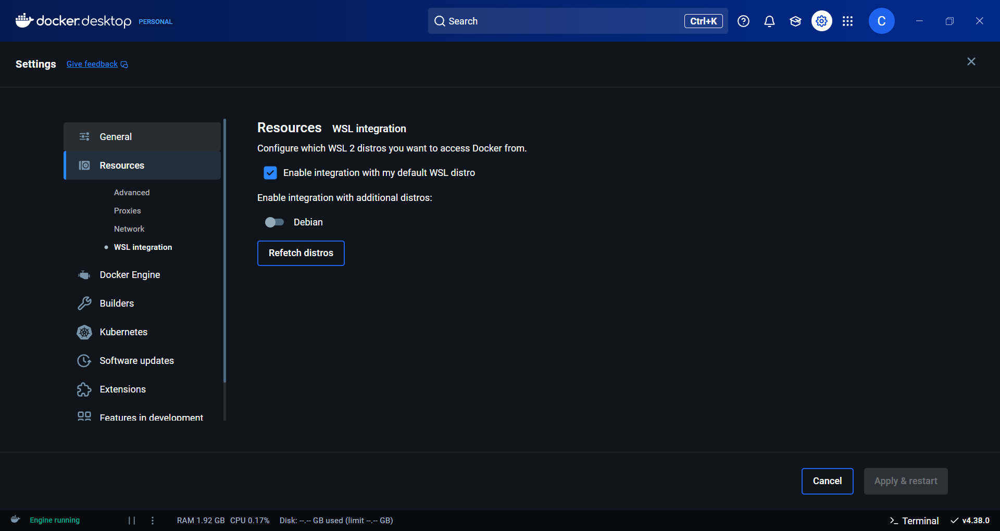
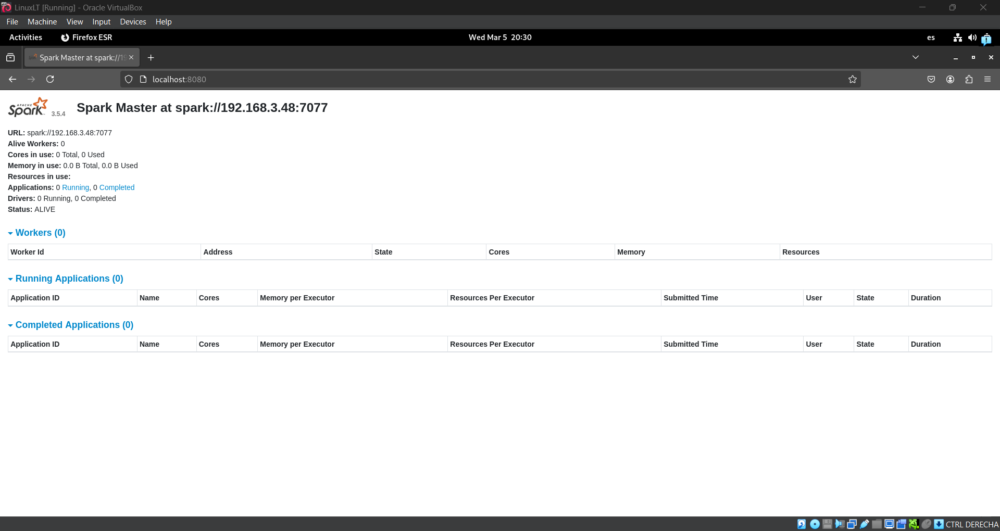
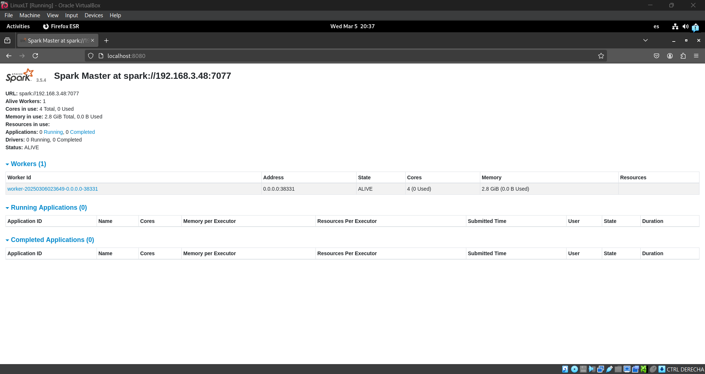
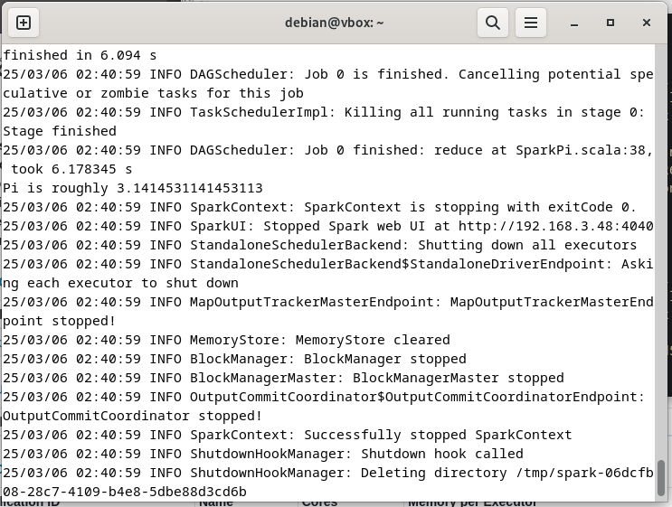
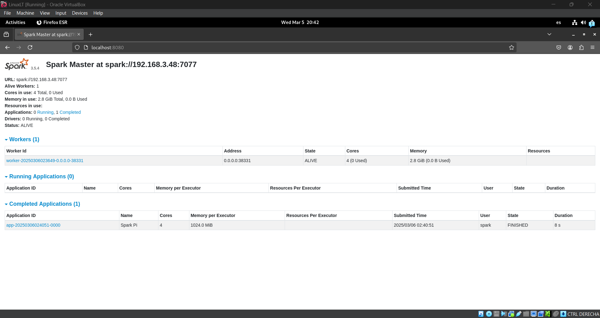

# Target
In this repo, I'll cover some of the steps I took to set up a Spark cluster with up to 20 nodes using Docker. One key point to note is that the cluster uses containers created on WSL for Windows as well as containers set up on a Linux machine. This documentation covers everything from installing the required software to making network adjustments and includes tests and reports along the way.
First things first, let's get the software installed.
# Software Installation
## Docker
To install Docker on Debian, you can see the official documentation [here](https://docs.docker.com/engine/install/debian/). Based on my experience, I recommend using docker desktop as it is more intuitive and user-friendly, but you can just install the docker engine if you prefer or have limited resources, also this is what you're likely found on real work environments.

To install Docker on Windows, you can use the following link: [Docker Desktop](https://www.docker.com/products/docker-desktop) (I suggest to see the next section before). It is important to note that Docker Desktop runs a Linux VM in the background, and you will need to enable WSL2 to run Linux containers.
Also, it is recommended to install a Linux distribution on WSL2 to interact with the containers in a more efficient way. I'll be using Debian 12 for this documentation.
So, let's start by installing WSL2 with Debian 12.
## WSL2 (Only for those who don't want or can't use Linux)
To install WSL2 on Windows, you can follow the official documentation [here](https://docs.microsoft.com/en-us/windows/wsl/install).
A key point is that you need to have Windows 10 version 1903 (AKA Windows 10, for simplicity) or higher to install WSL2, is also required to have a machine capable of running virtualization.

A simple guide to install WSL2 is as follows:
```PowerShell
# In PowerShell as Administrator
wsl --install -d Debian
```
After the installation is complete, you can access the Debian terminal by typing `wsl` in the Windows terminal and it will ask you to set up a username and password.
## Docker on WSL2
It is preferable to not install Docker on WSL2 as it can cause issues with the Docker Desktop installation. Instead, you can use the Docker Desktop to manage the containers on WSL2.
To do this, you need to enable the WSL2 integration in the Docker Desktop settings.
1. Open Docker Desktop
2. Go to Settings
3. Go to Resources
4. Go to WSL Integration
5. Enable the integration for the WSL2 distribution you want to use
6. Click Apply & Restart

It should look like this:

Keep in mind that the docker commands will only work on the WSL2 terminal if you have Docker Desktop running.

## Network Configuration on WSL2
To avoid issues with WSL networking, and based on my experience, it is recommended to switch the WSL2 network configuration from NAT to the Mirrored mode. This will replicate the interfaces from the Windows host to the WSL2 distribution, making it easier to access the containers from the Windows host.
In order to do this, you will need to create a `.wslconfig` file in your user directory with the following content:
```bash
[wsl2]
networkingMode=mirrored
```
After creating the file, you will need to restart the WSL2 distribution if running. After that, you should be able to access the containers from the Windows host using the IP address of the WSL2 distribution.

# Initial Containers test
To test the Docker installation, you can run the following command:
```bash
docker run hello-world
```
If everything is working correctly, you should see a message saying that the installation was successful.

## Spark containers
First, we need to create a container with the Spark image. To do this, is necessary to pull the image from the Docker Hub, there are different versions of the image, such as Spark, Apache/Spark, and Bitnami/Spark as the most popular ones. For this test I used the Spark official image, but the final choice is still not defined, which will be based on the researchs and tests that are being done by other teams and myself.
To pull the image, you can use the following command:
```bash
docker pull spark:latest
```
This test is using the host network mode, which means that the container will use the host network interface. This is very likely to change in the future, but for now, it is a simple way to test the Spark container with a virtual machine and a WSL2 distribution.
We're going to create two containers, one for the master and one for the worker. The master container will be created with the following command:
```bash
docker run -d   --name spark-master   --network=host -e SPARK_MASTER_HOST=<master-ip>   -e SPARK_MASTER_WEBUI_HOST=0.0.0.0   spark:latest   /opt/spark/bin/spark-class org.apache.spark.deploy.master.Master
```
In this command, you need to replace `<master-ip>` with the IP address of your computer without the brackets. If you're using WSL2, you can find the IP address by running the following command:
```bash
hostname -I
```
Which, due to the mirrored network configuration, will return the IP address of the Windows host.
After running the command, you can access the Spark UI by going to `http://<master-ip>:8080` in your brovirwser. You should see the Spark master UI with no workers connected.
It might look like this:

Now, let's create the worker container. The worker container will be created with the following command:
```bash
docker run -d   --name spark-worker   -p 8081:8081   -e SPARK_WORKER_WEBUI_HOST=0.0.0.0   -e SPARK_LOCAL_IP=0.0.0.0   spark:latest   /opt/spark/bin/spark-class org.apache.spark.deploy.worker.Worker spark://<master-ip>:7077
```
Again, replace `<master-ip>` with the IP address of the master computer. After this container is running, you should see the worker connected to the master in the Spark UI.
It might look like this:

Great! Now both the master and worker containers are running and connected. I'll test the Spark cluster with a simple application in the next section.

## Running a simple Spark application
We're going to run a simple Spark application to test the cluster. This application is already included in the Spark image and can be run with the following command:
```bash
docker exec spark-master   /opt/spark/bin/spark-submit   --master spark://<master-ip>:7077   --conf spark.driver.host=192.168.3.48   --class org.apache.spark.examples.SparkPi   /opt/spark/examples/jars/spark-examples_2.12-3.5.4.jar 100
```
This command will run the SparkPi example application, which calculates an approximation of Pi using the Monte Carlo method. The number `100` at the end of the command is the number of iterations the application will run. You can change this number to increase or decrease the accuracy of the approximation.
After running the command, you should see the output of the application in the terminal. It will show the value of Pi calculated by the application.
The final result might look like this:

Also, you will notice that the Spark UI will show the application in the "Completed Applications" section, or in the "Running Applications" section if the application is still running.
It might look like this:


And that's the end of the initial test. Some of the next steps will include setting up a more complex network configuration, avoiding the use of the host network mode, creating a Docker Compose file to manage the containers and include more tools in the cluster such as Hadoop, Jupyter, or other tools that might be required for the project. Let me know if you have any questions or suggestions for this or the next steps.

# Docker Swarm
Docker Swarm is a container orchestration tool that allows you to manage a cluster of Docker nodes across multiple machines, as Docker Networks are limited to multiple containers on the same host, but we're looking to multiple containers on multiple hosts. Due to Docker Swarm being a built-in feature of Docker, it is not necessary to install any additional software to use it.
Same as the previous section, we're going to use the virtual machine and the WSL2 distribution to simulate a LAN network.
## Creating a Swarm
The first step is to create a "Docker Swarm", which can be done by running the following command:
```bash
# On the master node
docker swarm init --advertise-addr <master-ip>
```
This will return a token that can be used to join other nodes to the swarm. You can find the token in the output of the command and it will have a format similar to this:
```bash
SWMTKN-1-xxxxxxxx
```
The ouptut may include some additional information including your IP address and the port number of the swarm manager which is `2377`.
, but the token is the key part, including the `SWMTKN-1-` prefix.
Ensure to keep it at hand as it will be used to join the worker nodes to the swarm.
## Joining a node to the Swarm
To join a node to the swarm, you need to run the following command on the worker node:
```bash
docker swarm join --token <token> <master-ip>:2377
```
You'll see a message saying that the node has joined the swarm. You can check the status of the nodes in the swarm by running the following command on the master node:
```bash
docker node ls
```
Here you should see the master node and the worker node listed as "Ready".

Is important to note that only a manager node can create services and manage the swarm, while worker nodes can only run services. In this case, the master node is the manager node and the worker node is a worker node.

## Creating an overlay network

While Docker has built-in networking capabilities, the Docker Networks are limited to multiple containers on the same host. To create a network that spans multiple hosts, we need to create an "overlay network", which is a network that connects multiple nodes in a Docker Swarm.
To create an overlay network, you can run the following command on the master node:
```bash
docker network create --driver overlay <network-name>
#Alternatively, you can use the following command with the --driver flag shortened to -d
docker network create -d overlay <network-name>
```

An example of the command would be:
```bash
docker network create -d overlay spark-cluster-net
```

This will create an overlay network that spans all the nodes in the swarm. You can check the status of the network by running the following command on the master node:
```bash
docker network ls
```
You should see the overlay network listed in the output.

## Labeling nodes
To manage the containers in the swarm, we can use labels to identify the nodes. This is useful for running specific containers on specific nodes or for load balancing purposes.
To label nodes, you can run the following command on the master node:
```bash
docker node update --label-add <label>=<value> <node-id>
```
Here, the <label> value is the name of the label you want to add, and has no specific format or restrictions. The <value> is the value of the label, and the <node-id> is the ID of the node you want to label which you can find by running the `docker node ls` command, you could also use the node name instead of the node ID, but the ID is more reliable to avoid conflicts of duplicated names.
In this spark cluster example, we can label the nodes as "master" and "worker" to identify their roles. To do this, you can run the following commands:
```bash
docker node update --label-add spark-role=master <master-node-id>
docker node update --label-add spark-role=worker <worker-node-id>
```
We can see the labels of a node by inspecting the node. To do this, you can run the command 'docker node inspect <node-id>'.

## Docker Compose
So far, I've been using the oficial Spark image to create the containers, but this image is not suitable for a cluster environment as it requires manual configuration of the master and worker nodes, and due to some redundancy in the configuration, it is likely to cause issues in a real-world scenario, as I've been experiencing in the tests.
For simplicity, I'll be using the Bitnami Spark image, which is a pre-configured image that is prepared to set up a cluster out of the box. The Bitnami Spark image is available on the Docker Hub and can be pulled with the following command:
```bash
docker pull bitnami/spark:latest
```
Also, I'd like to mention the example provided by Eithan on it's [docker-cluster repo](https://github.com/eithan-hernandez/docker-cluster/tree/main), and I'll be using the same image and similar configurations to set up the Spark cluster.
To deploy services easily in the Docker Swarm, we can use Docker Compose. Docker Compose is a tool that allows you to define and run multi-container Docker applications using a YAML file. Deploying services individually can be tricky, because you need to specify the network, volumes, and other configurations for each service, and with my current implementations, you require to specify network configurations for each container, including explicit IP addresses, to solve DNS issues, docker-compose will handle this for us, allowing to focus on the services and configurations.
To use Docker Compose, you need to create a `docker-compose.yml` file in the directory where you want to deploy the services. The file should contain the configurations for the services you want to deploy.
You can see the content of the compose file in Eithan's repo, but I'll provide a brief explanation of the services and configurations in the file.
